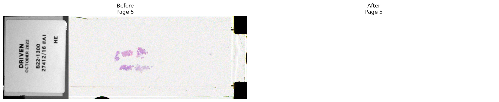

# POPIDD’s Sveil


<!-- WARNING: THIS FILE WAS AUTOGENERATED! DO NOT EDIT! -->

## Installation

### For developers

## Usage

### Documentation

### Quickstart

``` python
help(remove_label)
```

    Help on function remove_label in module popidd_sveil.core:

    remove_label(
        path: str | pathlib._local.Path,
        *,
        mode: popidd_sveil.core.OperationMode | str = <OperationMode.COPY: 'copy'>,
        output: str | pathlib._local.Path | None = None,
        overwrite: bool = False,
        relative_tolerance: float = 0.01
    ) -> popidd_sveil.core.AnonymizationResult
        Replace the detected label page with a blank image.

        Copy mode preserves the source slide and writes an anonymised copy.
        In-place mode modifies the source slide directly.

        Parameters
        ----------
        path
            Path to the source slide.
        mode
            Whether to create an anonymised copy or modify the source.
        output
            Explicit destination in copy mode. If omitted,
            `default_output_path` determines the destination.
        overwrite
            Whether an existing destination may be replaced.
        relative_tolerance
            Maximum relative difference used for aspect-ratio grouping.

        Returns
        -------
        AnonymizationResult
            Summary of the completed operation.

        Raises
        ------
        UnsupportedSlideError
            If the slide format is unsupported.
        LabelNotFoundError
            If no label page can be detected.
        AmbiguousLabelError
            If multiple plausible label pages are detected.
        UnsupportedLabelEncodingError
            If the detected page cannot be replaced safely.
        OutputExistsError
            If the destination already exists and `overwrite` is `False`.
        ReplacementImageError
            If replacement generation or post-processing validation fails.

        See Also
        --------
        `inspect_slide`
        `find_label_page`
        `prepare_replacement`
        `apply_replacement`
        `AnonymizationResult`

``` python
source = Path("../input/pid.ndpi")
source_info = inspect_slide(source)
source_label = find_label_page(source_info)

with tifffile.TiffFile(source) as slide:
    before = slide.pages[source_label.index].asarray()

with TemporaryDirectory() as directory:
    output = Path(directory) / source.name

    result = remove_label(
        source,
        mode="copy",
        output=output,
    )

    with tifffile.TiffFile(output) as slide:
        after = slide.pages[result.label_page].asarray()

    fig, axes = plt.subplots(
        1,
        2,
        figsize=(16, 5),
    )

    axes[0].imshow(before)
    axes[0].set_title(f"Before\nPage {source_label.index}")
    axes[0].axis("off")

    axes[1].imshow(after)
    axes[1].set_title(f"After\nPage {result.label_page}")
    axes[1].axis("off")

    plt.tight_layout()
    plt.show()
```


