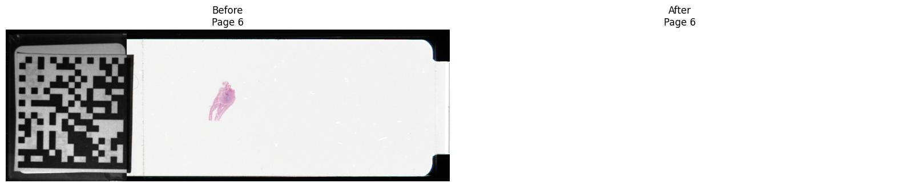

# core


<!-- WARNING: THIS FILE WAS AUTOGENERATED! DO NOT EDIT! -->

## Overview

## Exceptions

Core exception types used by the public API.

    /home/runner/work/popidd-sveil/popidd-sveil/.venv/lib/python3.12/site-packages/fastcore/docscrape.py:259: UserWarning: Unknown section See Also
      else: warn(msg)

------------------------------------------------------------------------

### OperationMode

``` python

def OperationMode(
    args:VAR_POSITIONAL, kwds:VAR_KEYWORD
):

```

*Specify how an anonymised slide is written.*

------------------------------------------------------------------------

### ReplacementImageError

``` python

def ReplacementImageError(
    args:VAR_POSITIONAL, kwargs:VAR_KEYWORD
):

```

*Raised when a replacement image cannot be created or validated.*

------------------------------------------------------------------------

### UnsupportedLabelEncodingError

``` python

def UnsupportedLabelEncodingError(
    args:VAR_POSITIONAL, kwargs:VAR_KEYWORD
):

```

*Raised when a label page uses an unsupported storage layout.*

------------------------------------------------------------------------

### OutputExistsError

``` python

def OutputExistsError(
    args:VAR_POSITIONAL, kwargs:VAR_KEYWORD
):

```

*Raised when an output path exists and overwriting is disabled.*

------------------------------------------------------------------------

### UnsafeSegmentError

``` python

def UnsafeSegmentError(
    args:VAR_POSITIONAL, kwargs:VAR_KEYWORD
):

```

*Raised when an image segment cannot be modified safely.*

------------------------------------------------------------------------

### AmbiguousLabelError

``` python

def AmbiguousLabelError(
    args:VAR_POSITIONAL, kwargs:VAR_KEYWORD
):

```

*Raised when multiple plausible label pages are detected.*

------------------------------------------------------------------------

### LabelNotFoundError

``` python

def LabelNotFoundError(
    args:VAR_POSITIONAL, kwargs:VAR_KEYWORD
):

```

*Raised when no candidate label or macro page can be detected.*

------------------------------------------------------------------------

### UnsupportedSlideError

``` python

def UnsupportedSlideError(
    args:VAR_POSITIONAL, kwargs:VAR_KEYWORD
):

```

*Raised when a slide format or file extension is unsupported.*

------------------------------------------------------------------------

### SveilError

``` python

def SveilError(
    args:VAR_POSITIONAL, kwargs:VAR_KEYWORD
):

```

*Base exception for errors raised by `popidd_sveil`.*

## Data Models

Lightweight dataclasses representing slide and page metadata, and
anonymisation results.

------------------------------------------------------------------------

### ImageReplacement

``` python

def ImageReplacement(
    page_index:int, offset:int, allocated_bytes:int, encoded_image:bytes
)->None:

```

*Describe an encoded image prepared for binary replacement.*

------------------------------------------------------------------------

### AnonymizationResult

``` python

def AnonymizationResult(
    source_path:Path, output_path:Path, format:SlideFormat, mode:OperationMode, label_page:int, detection_method:str,
    original_bytes:int, replacement_bytes:int
)->None:

```

*Summarise a completed label-removal operation.*

------------------------------------------------------------------------

### LabelLocation

``` python

def LabelLocation(
    page_index:int, detection_method:str, offsets:tuple[int, ...], byte_counts:tuple[int, ...]
)->None:

```

*Describe the storage location of a detected label page.*

------------------------------------------------------------------------

### SlideInfo

``` python

def SlideInfo(
    path:Path, format:SlideFormat, byte_order:str, is_bigtiff:bool, pages:tuple[PageInfo, ...]
)->None:

```

*Store structural metadata for a TIFF-based pathology slide.*

------------------------------------------------------------------------

### PageInfo

``` python

def PageInfo(
    index:int, shape:tuple[int, ...], height:int, width:int, aspect_ratio:float, description:str,
    new_subfile_type:int | None, compression:str, photometric:str, samples_per_pixel:int,
    bits_per_sample:tuple[int, ...], magnification:float | None, offsets:tuple[int, ...],
    byte_counts:tuple[int, ...]
)->None:

```

*Store structural metadata for a TIFF page.*

------------------------------------------------------------------------

### SlideFormat

``` python

def SlideFormat(
    args:VAR_POSITIONAL, kwds:VAR_KEYWORD
):

```

*Identify the supported TIFF-based slide formats.*

## Slide Inspection

Utilities to inspect TIFF slides and obtain structured metadata via
`inspect_slide`.

------------------------------------------------------------------------

### inspect_slide

``` python

def inspect_slide(
    path:str | Path, # Path to an SVS, NDPI, TIF, or TIFF slide.
)->SlideInfo: # Structural metadata for the slide and its TIFF pages.

```

*Inspect a TIFF-based slide without decoding its full image pyramid.*

------------------------------------------------------------------------

### slide_report

``` python

def slide_report(
    path:str | Path, # Path to the slide to inspect.
)->str: # Multiline report describing the slide and each TIFF page.

```

*Create a human-readable report of slide and page metadata.*

------------------------------------------------------------------------

### aspect_ratios_match

``` python

def aspect_ratios_match(
    first:float, # First aspect ratio.
    second:float, # Second aspect ratio.
    relative_tolerance:float=0.01, # Maximum relative difference accepted as a match.
)->bool: # `True` when the ratios match and are both positive.

```

*Test whether two aspect ratios agree within a relative tolerance.*

------------------------------------------------------------------------

### group_pages_by_aspect_ratio

``` python

def group_pages_by_aspect_ratio(
    pages:Sequence[PageInfo], # Page metadata to group.
    relative_tolerance:float=0.01, # Maximum relative difference between matching aspect ratios.
)->tuple[tuple[PageInfo, ...], ...]: # Groups of pages with similar aspect ratios.

```

*Group TIFF pages with similar aspect ratios.*

Pages are considered in descending order of pixel area. Each page is
assigned to the first group whose reference aspect ratio matches
according to `aspect_ratios_match`.

## Pyramid Detection

Helpers to group pages by aspect ratio and identify the TIFF pyramid
pages.

------------------------------------------------------------------------

### find_pyramid_pages

``` python

def find_pyramid_pages(
    info:SlideInfo, # Slide metadata returned by `inspect_slide`.
    relative_tolerance:float=0.01, # Maximum relative difference between matching aspect ratios.
)->tuple[PageInfo, ...]: # Pages classified as pyramid levels.

```

*Identify the dominant aspect-ratio group as the image pyramid.*

The group containing the largest number of pages is selected. Pixel area
is used to resolve ties between groups of equal size.

------------------------------------------------------------------------

### find_associated_pages

``` python

def find_associated_pages(
    info:SlideInfo, # Slide metadata returned by `inspect_slide`.
    relative_tolerance:float=0.01, # Maximum relative difference used for pyramid grouping.
)->tuple[PageInfo, ...]: # Pages outside the dominant pyramid group.

```

*Return pages that do not belong to the detected image pyramid.*

## Label Detection

Format-specific heuristics to detect label/macro pages
(`find_label_page` delegates to these helpers).

------------------------------------------------------------------------

### is_colour_page

``` python

def is_colour_page(
    page:PageInfo, # Page metadata to inspect.
)->bool: # `True` when the page has at least three samples per pixel and
uses a recognised colour photometric interpretation.

```

*Determine whether a page represents a recognised colour image.*

------------------------------------------------------------------------

### find_ndpi_label_page

``` python

def find_ndpi_label_page(
    info:SlideInfo, # NDPI slide metadata returned by `inspect_slide`.
    relative_tolerance:float=0.01, # Maximum relative difference used for pyramid grouping.
)->PageInfo: # Metadata for the detected label or macro page.

```

*Detect the colour label or macro page in an NDPI slide.*

The detector excludes pages belonging to the dominant image pyramid and
selects the unique remaining colour page.

------------------------------------------------------------------------

### find_svs_label_page

``` python

def find_svs_label_page(
    info:SlideInfo, # SVS slide metadata returned by `inspect_slide`.
    relative_tolerance:float=0.01, # Maximum relative difference used for pyramid grouping.
)->PageInfo: # Metadata for the detected label page.

```

*Detect a probable label page in an SVS slide.*

Detection prioritises a colour associated page with TIFF NewSubfileType
1, followed by an explicit label description and finally a unique
eligible colour page outside the image pyramid.

------------------------------------------------------------------------

### find_tiff_label_page

``` python

def find_tiff_label_page(
    info:SlideInfo, # TIFF slide metadata returned by `inspect_slide`.
    relative_tolerance:float=0.01, # Maximum relative difference used for pyramid grouping.
)->PageInfo: # Metadata for the detected label page.

```

*Detect a probable label page in a generic TIFF slide.*

Detection first considers pages explicitly described as labels. If none
are found, the unique colour page outside the dominant image pyramid is
selected.

------------------------------------------------------------------------

### find_label_page

``` python

def find_label_page(
    info:SlideInfo, # Slide metadata returned by `inspect_slide`.
    relative_tolerance:float=0.01, # Maximum relative difference used for aspect-ratio grouping.
)->PageInfo: # Metadata for the detected label or macro page.

```

*Detect the label or macro page using format-specific rules.*

------------------------------------------------------------------------

### describe_label_candidate

``` python

def describe_label_candidate(
    path:str | Path, # Path to the slide to inspect.
    relative_tolerance:float=0.01, # Maximum relative difference used for aspect-ratio grouping.
)->str: # Human-readable description of the selected page.

```

*Describe the label page selected for a slide.*

------------------------------------------------------------------------

### validate_label_page_for_replacement

``` python

def validate_label_page_for_replacement(
    page:PageInfo, # Candidate label page to validate.
)->None:

```

*Validate that a label page supports in-place JPEG replacement.*

The current replacement implementation requires a colour page stored as
a single JPEG or old-style JPEG segment.

## Replacement Generation

Helpers to validate label encoding and to produce an appropriately-sized
blank JPEG replacement.

------------------------------------------------------------------------

### create_blank_jpeg

``` python

def create_blank_jpeg(
    width:int, # Image width in pixels.
    height:int, # Image height in pixels.
    maximum_bytes:int, # Maximum permitted size of the encoded JPEG.
    colour:tuple[int, int, int]=(255, 255, 255), # RGB colour used to fill the replacement image.
)->bytes: # Encoded JPEG data no larger than `maximum_bytes`.

```

*Encode a blank RGB JPEG within a fixed byte allocation.*

------------------------------------------------------------------------

### prepare_replacement

``` python

def prepare_replacement(
    page:PageInfo, # Detected label page returned by `find_label_page`.
)->ImageReplacement: # Encoded blank image and its target storage location.

```

*Prepare a blank encoded replacement for a label page.*

------------------------------------------------------------------------

### validate_replacement

``` python

def validate_replacement(
    path:str | Path, # Path to the slide that will be modified.
    replacement:ImageReplacement, # Prepared replacement returned by `prepare_replacement`.
)->None:

```

*Validate a prepared replacement against its target slide.*

------------------------------------------------------------------------

### apply_replacement

``` python

def apply_replacement(
    path:str | Path, # Path to the slide to modify.
    replacement:ImageReplacement, # Prepared replacement returned by `prepare_replacement`.
)->None:

```

*Overwrite a label segment with an encoded replacement image.*

Remaining bytes in the original allocation are overwritten with zeros
after the replacement JPEG.

## File Modification

Functions that perform in-place binary updates safely and with padding.

------------------------------------------------------------------------

### prepare_output_path

``` python

def prepare_output_path(
    source:str | Path, # Path to the source slide.
    mode:OperationMode | str=<OperationMode.COPY: 'copy'>, # Whether to create a copy or modify the source in place.
    output:str | Path | None=None, # Explicit destination used in copy mode. If omitted,
`default_output_path` determines the destination.
    overwrite:bool=False, # Whether an existing destination may be replaced.
)->Path: # Path that should be modified or created.

```

*Validate and resolve the path to a processed slide.*

------------------------------------------------------------------------

### default_output_path

``` python

def default_output_path(
    path:str | Path, # Source slide path.
)->Path: # Default output path in the source directory.

```

*Construct the default path for an anonymised copy.*

The returned filename inserts `".sveil"` before the original file
extension.

------------------------------------------------------------------------

### validate_processed_slide

``` python

def validate_processed_slide(
    path:str | Path, # Path to the processed slide.
    page_index:int, # Zero-based index of the replaced page.
)->None:

```

*Verify that a processed TIFF page remains decodable.*

------------------------------------------------------------------------

### validate_blank_page

``` python

def validate_blank_page(
    path:str | Path, # Path to the processed slide.
    page_index:int, # Zero-based index of the replaced page.
    minimum_mean:float=250.0, # Minimum permitted mean pixel value.
)->None:

```

*Verify that a processed page decodes as a near-white image.*

------------------------------------------------------------------------

### label_detection_method

``` python

def label_detection_method(
    info:SlideInfo, # Metadata for the inspected slide.
    page:PageInfo, # Label page selected by `find_label_page`.
)->str: # Stable identifier for the detection rule.

```

*Describe the rule that selected a label page.*

------------------------------------------------------------------------

### remove_label

``` python

def remove_label(
    path:str | Path, # Path to the source slide.
    mode:OperationMode | str=<OperationMode.COPY: 'copy'>, # Whether to create an anonymised copy or modify the source.
    output:str | Path | None=None, # Explicit destination in copy mode. If omitted,
`default_output_path` determines the destination.
    overwrite:bool=False, # Whether an existing destination may be replaced.
    relative_tolerance:float=0.01, # Maximum relative difference used for aspect-ratio grouping.
)->AnonymizationResult: # Summary of the completed operation.

```

*Replace the detected label page with a blank image.*

Copy mode preserves the source slide and writes an anonymised copy.
In-place mode modifies the source slide directly.

## Examples

``` python
def report_detection(
    path: str | Path,
) -> None:
    """
    Print a diagnostic summary of label-page detection.

    Parameters
    ----------
    path
        Path to the slide to inspect.

    Returns
    -------
    None

    See Also
    --------
    `slide_report`
    `find_pyramid_pages`
    `find_associated_pages`
    `find_label_page`
    """
    info = inspect_slide(path)
    pyramid = find_pyramid_pages(info)
    associated = find_associated_pages(info)
    label = find_label_page(info)

    print("Format:", info.format.value)
    print(
        "Pyramid:",
        [page.index for page in pyramid],
    )
    print(
        "Associated:",
        [page.index for page in associated],
    )
    print("Selected label:", label.index)
    print(
        "Detection method:",
        label_detection_method(info, label),
    )

    for page in associated:
        print(
            f"Page {page.index}: "
            f"{page.width}×{page.height}, "
            f"ratio={page.aspect_ratio:.3f}, "
            f"subfiletype={page.new_subfile_type}, "
            f"photometric={page.photometric}, "
            f"compression={page.compression}, "
            f"segments={len(page.offsets)}"
        )
```

``` python
print(slide_report(image_path))
```

    Path: ../input/pid.ndpi
    Format: ndpi
    Byte order: <
    BigTIFF: False
    Pages: 8

    Page 0
      Shape: (39168, 30720, 3)
      Dimensions: 30720 × 39168
      Aspect ratio: 0.784314
      Description: ''
      NewSubfileType: None
      Magnification: 40.0
      Compression: JPEG
      Photometric: YCBCR
      Samples per pixel: 3
      Bits per sample: (8,)
      Segments: 39168
      Encoded bytes: 156706015

    Page 1
      Shape: (19584, 15360, 3)
      Dimensions: 15360 × 19584
      Aspect ratio: 0.784314
      Description: ''
      NewSubfileType: None
      Magnification: 20.0
      Compression: JPEG
      Photometric: YCBCR
      Samples per pixel: 3
      Bits per sample: (8,)
      Segments: 19584
      Encoded bytes: 34674486

    Page 2
      Shape: (9792, 7680, 3)
      Dimensions: 7680 × 9792
      Aspect ratio: 0.784314
      Description: ''
      NewSubfileType: None
      Magnification: 10.0
      Compression: JPEG
      Photometric: YCBCR
      Samples per pixel: 3
      Bits per sample: (8,)
      Segments: 9792
      Encoded bytes: 8267640

    Page 3
      Shape: (4896, 3840, 3)
      Dimensions: 3840 × 4896
      Aspect ratio: 0.784314
      Description: ''
      NewSubfileType: None
      Magnification: 5.0
      Compression: JPEG
      Photometric: YCBCR
      Samples per pixel: 3
      Bits per sample: (8,)
      Segments: 4896
      Encoded bytes: 2179197

    Page 4
      Shape: (2448, 1920, 3)
      Dimensions: 1920 × 2448
      Aspect ratio: 0.784314
      Description: ''
      NewSubfileType: None
      Magnification: 2.5
      Compression: JPEG
      Photometric: YCBCR
      Samples per pixel: 3
      Bits per sample: (8,)
      Segments: 2448
      Encoded bytes: 583742

    Page 5
      Shape: (1224, 960, 3)
      Dimensions: 960 × 1224
      Aspect ratio: 0.784314
      Description: ''
      NewSubfileType: None
      Magnification: 1.25
      Compression: JPEG
      Photometric: YCBCR
      Samples per pixel: 3
      Bits per sample: (8,)
      Segments: 1224
      Encoded bytes: 149445

    Page 6
      Shape: (648, 1890, 3)
      Dimensions: 1890 × 648
      Aspect ratio: 2.916667
      Description: ''
      NewSubfileType: None
      Magnification: -1.0
      Compression: JPEG
      Photometric: YCBCR
      Samples per pixel: 3
      Bits per sample: (8,)
      Segments: 1
      Encoded bytes: 117300

    Page 7
      Shape: (205, 600, 1)
      Dimensions: 600 × 205
      Aspect ratio: 2.926829
      Description: ''
      NewSubfileType: None
      Magnification: -2.0
      Compression: NONE
      Photometric: RGB
      Samples per pixel: 1
      Bits per sample: (8,)
      Segments: 1
      Encoded bytes: 123000

``` python
report_detection(image_path)
```

    Format: ndpi
    Pyramid: [0, 1, 2, 3, 4, 5]
    Associated: [6, 7]
    Selected label: 6
    Detection method: ndpi-aspect-ratio-and-colour
    Page 6: 1890×648, ratio=2.917, subfiletype=None, photometric=YCBCR, compression=JPEG, segments=1
    Page 7: 600×205, ratio=2.927, subfiletype=None, photometric=RGB, compression=NONE, segments=1

``` python
source = image_path
source_info = inspect_slide(source)
source_label = find_label_page(source_info)

with tifffile.TiffFile(source) as slide:
    before = slide.pages[source_label.index].asarray()

with TemporaryDirectory() as directory:
    output = Path(directory) / source.name

    result = remove_label(
        source,
        mode="copy",
        output=output,
    )

    with tifffile.TiffFile(output) as slide:
        after = slide.pages[result.label_page].asarray()

    fig, axes = plt.subplots(
        1,
        2,
        figsize=(16, 5),
    )

    axes[0].imshow(before)
    axes[0].set_title(f"Before\nPage {source_label.index}")
    axes[0].axis("off")

    axes[1].imshow(after)
    axes[1].set_title(f"After\nPage {result.label_page}")
    axes[1].axis("off")

    plt.tight_layout()
    plt.show()
```


